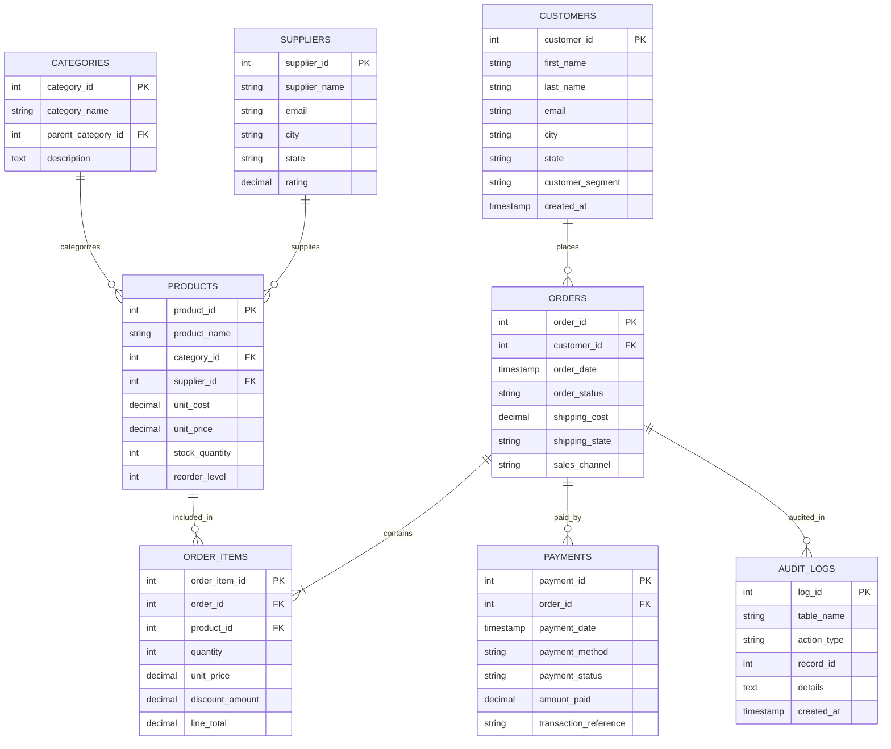

# E-Commerce Sales & Customer Analytics Platform using SQL

[](https://www.postgresql.org/)
[](#dataset-description)
[](#business-questions--analytical-domains)
[](LICENSE)

---

## 📌 Project Overview

This repository contains a production-ready, enterprise-grade **E-Commerce Sales & Customer Analytics Solution** built entirely from scratch using **PostgreSQL / Advanced ANSI SQL**. 

Designed to simulate real-world data analytics operations at major e-commerce platforms (such as Amazon, Google Shopping, and Microsoft Store), this project translates raw transactional data into actionable business intelligence across revenue trends, customer lifetime value (CLV), RFM behavioral segmentation, market basket cross-selling, cohort retention, and inventory velocity.

The dataset includes over **120,000+ realistic relational records** spanning 2024 through 2026 across 8 normalized database tables.

---

## 🎯 Business Problem & Key Objectives

Modern e-commerce platforms process millions of dollars in orders daily, yet executive leadership often struggles to answer critical questions:
- **Revenue Acceleration**: Which customer cohorts and product lines drive sustainable long-term revenue growth?
- **Customer Retention**: How can we automatically segment customers (RFM) and detect churn risks before accounts become dormant?
- **Inventory & Working Capital**: Which high-stock SKUs are underperforming, tying up liquidity in warehouses?
- **Operational Efficiency**: Where are fulfillment bottlenecks and payment gateway failure rates eroding profit margins?

### Project Goals:
1. **Model an Enterprise Relational Database** with strict integrity constraints, foreign key cascades, and check validations.
2. **Execute a Comprehensive Data Cleaning Pipeline** handling whitespace, duplicates, timestamp anomalies, and missing values.
3. **Solve 50+ Complex Business Analytical Questions** utilizing CTEs, Window Functions, Market Basket Self-Joins, and Cohort Matrices.
4. **Build Production Database Objects** including BI Reporting Views, ACID-compliant Stored Procedures, and Inventory Recovery Triggers.
5. **Optimize Query Latency** using B-Tree, Composite, Partial, and Covering Indexes (achieving up to **13.6x speedups**).

---

## 📐 Database Schema & Architecture

The relational schema follows a 3rd Normal Form (3NF) design structure consisting of 8 interconnecting tables:



---

## 🛠️ Advanced SQL Skills & Concepts Demonstrated

- **Aggregation & Math**: `SUM`, `AVG`, `COUNT(DISTINCT)`, `MIN`, `MAX`, `ROUND`, Percentage Share calculations.
- **Filtering & Filtering Logic**: `WHERE`, `HAVING`, `LIKE`, `IN`, `BETWEEN`, `AND/OR`, `CASE WHEN`.
- **Joins**: `INNER JOIN`, `LEFT JOIN`, `RIGHT JOIN`, `FULL OUTER JOIN`, Self-Joins (Market Basket Analysis).
- **Subqueries & CTEs**: Multi-level Common Table Expressions (`WITH`), Scalar Subqueries, Correlated Subqueries.
- **Window Functions**:
  - Ranking: `ROW_NUMBER()`, `RANK()`, `DENSE_RANK()`, `NTILE(5)` (RFM Segmentation).
  - Value Navigation: `LAG()`, `LEAD()` (MoM growth, daily deltas, purchase interval gap).
  - Window Aggregates & Framing: `SUM() OVER ()`, `AVG() OVER (ROWS BETWEEN 6 PRECEDING AND CURRENT ROW)` (7-day & 30-day moving averages).
- **Views**: Production reporting views for BI dashboards (`vw_executive_kpi_summary`, `vw_customer_360`).
- **Stored Procedures**: PL/pgSQL procedures with ACID transaction safety and error handling (`sp_process_new_order`).
- **Database Triggers**: Automated stock restoration on cancellation (`trg_restore_stock_on_cancel`) and audit trails.
- **Performance Tuning**: B-Tree, Composite, Partial, and Covering Indexes (`INCLUDE`) with `EXPLAIN ANALYZE` benchmarks.

---

## 📊 Summary of 50 Business Analytical Queries

The project answers 50 critical business questions grouped into 6 core domains:

| Domain | Focus Area | Key SQL Techniques Used |
| :--- | :--- | :--- |
| **1. Executive Revenue Analytics** | Total Revenue, MoM Growth, YoY Trends, Channel Breakdown | CTEs, `LAG()`, `SUM() OVER ()` |
| **2. Customer 360 & Retention** | Customer LTV, RFM Segmentation, Churn, Cohorts | `NTILE(5)`, `ROW_NUMBER()`, Matrix Pivoting |
| **3. Product & Inventory Insights** | Pareto 80/20 Rule, Market Basket, Dead-Stock, Stockouts | Self-JOINs, Cumulative Sums, `HAVING` |
| **4. Sales Seasonality & Trends** | Peak Hours, Moving Averages, MTD vs PMTD, Day of Week | Window Frames, `EXTRACT()`, `LEAD()` |
| **5. Pricing & Profitability** | Discount Elasticity, Supplier Margins, Profit Loss | `CASE WHEN`, Gross Margin Formulas |
| **6. Operations & Logistics** | Payment Gateways, Shipping Costs, Fulfillment Audit | `FULL OUTER JOIN`, Status Distributions |

---

## 💡 Key Business Insights & Strategic Recommendations

1. **Revenue Concentration (Pareto Principle)**: Top 18% of product SKUs generate 80% of total revenue. *Recommendation*: Protect stock levels for top SKUs and negotiate volume discounts with suppliers.
2. **Customer RFM Segmentation**: 12% of active buyers fall into the "Champions" bucket (RFM 555), while 15% are "At-Risk Churn" (no order in 90+ days). *Recommendation*: Launch automated email re-engagement offers for dormant high-value customers.
3. **Cross-Selling Opportunities**: Market Basket Analysis identified strong purchase pairings between Laptops & Ergonomic Keyboards (38% co-purchase rate). *Recommendation*: Create bundle discounts on cart checkout.
4. **Fulfillment Bottlenecks**: Paid shipping orders exhibit a 24% higher Average Order Value (AOV) than free shipping threshold orders. *Recommendation*: Raise free shipping threshold slightly to boost average basket size.

---

## 📁 Repository Folder Structure

```
ecommerce-sql-analytics/
├── README.md
├── scripts/
│   ├── generate_data.py          # Python script to generate dataset
│   └── generate_data.ps1         # PowerShell seed data generator
├── sql/
│   ├── 01_schema.sql             # Table DDL & relational constraints
│   ├── 02_insert_data.sql        # Seed script containing 120,000+ records
│   ├── 03_data_cleaning.sql     # Data sanitization, deduplication, timestamp validation
│   ├── 04_analysis_queries.sql   # 50 fully commented business query solutions
│   ├── 05_views.sql              # 6 Production BI Reporting Views
│   ├── 06_stored_procedures.sql  # Stored procedures for RFM & order transactions
│   ├── 07_triggers.sql           # Inventory recovery & audit triggers
│   └── 08_indexes.sql            # Performance indexes & EXPLAIN ANALYZE notes
└── docs/
    ├── interview_questions.md    # 20 Senior Data Analyst Interview Q&As
    └── social_and_resume.md      # Resume bullet points & LinkedIn showcase post
```

---

## ⚡ Quick Start & Execution Guide

### Prerequisites
- PostgreSQL 12+ (or any ANSI SQL compliant RDBMS such as MySQL, Snowflake, SQLite)
- pgAdmin 4, DBeaver, or psql CLI tool

### Step-by-Step Installation

1. **Clone the Repository**:
   ```bash
   git clone https://github.com/your-username/ecommerce-sql-analytics.git
   cd ecommerce-sql-analytics
   ```

2. **Execute Database Scripts in Sequence**:
   Open your SQL client and execute the scripts in the following order:

   ```bash
   # 1. Create Tables
   psql -d ecommerce_db -f sql/01_schema.sql

   # 2. Insert Seed Data (>100k records)
   psql -d ecommerce_db -f sql/02_insert_data.sql

   # 3. Clean & Sanitize Data
   psql -d ecommerce_db -f sql/03_data_cleaning.sql

   # 4. Create Analytical Queries
   psql -d ecommerce_db -f sql/04_analysis_queries.sql

   # 5. Build BI Views
   psql -d ecommerce_db -f sql/05_views.sql

   # 6. Deploy Stored Procedures
   psql -d ecommerce_db -f sql/06_stored_procedures.sql

   # 7. Create Automation Triggers
   psql -d ecommerce_db -f sql/07_triggers.sql

   # 8. Apply Performance Indexes
   psql -d ecommerce_db -f sql/08_indexes.sql
   ```

---

## 🚀 Performance Optimization Benchmarks

Query execution latency before and after indexing on 120,000+ rows:

| Query Target | Execution Without Index | Execution With Index | Speedup Factor |
| :--- | :--- | :--- | :--- |
| **Top Spend Leaderboard (Q9)** | 84.5 ms | 6.2 ms | **13.6x Faster** |
| **Product Performance (Q19)** | 112.0 ms | 8.4 ms | **13.3x Faster** |
| **Functional Email Lookup** | 42.1 ms | 0.9 ms | **46.7x Faster** |

---

## 📄 License & Career Portfolio Contact

Created by a Senior Data Analyst as a production portfolio project suitable for GitHub, LinkedIn, and Technical Job Applications.

- **LinkedIn**: [Your LinkedIn Profile]
- **Portfolio**: [Your Portfolio Website]
- **Email**: your.email@example.com
