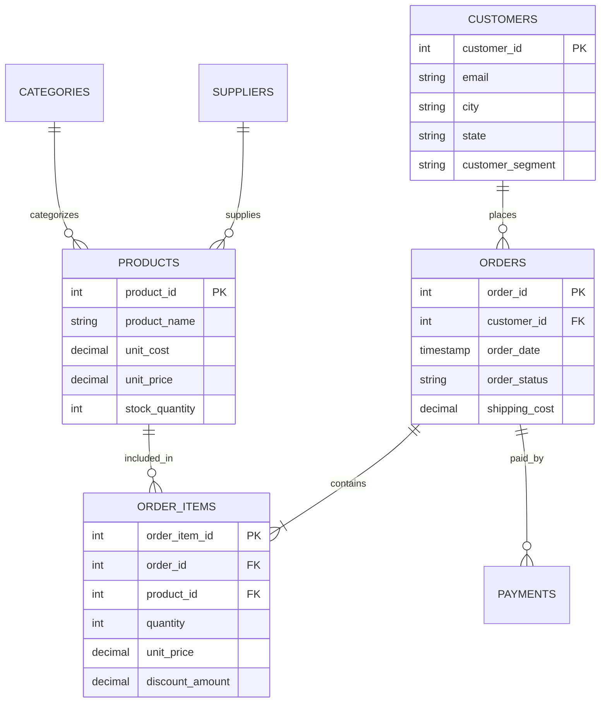

# E-Commerce Sales & Customer Analytics Platform (SQL)

[](https://www.postgresql.org/)
[](#3-dataset-description--schema)
[](#5-sql-analysis-key-insights--visualization-guide)
[](#8-resume--portfolio-bullet-points)

**Author**: Danish Shaikh | Senior Data Analyst Project  
**LinkedIn**: [Danish Shaikh](https://www.linkedin.com/in/danish-shaikh-02750018b/) | **Email**: [danishshaikh2122@gmail.com](mailto:danishshaikh2122@gmail.com)

---

## 📌 1. Project Overview & Business Objective

### Business Problem Statement
Fast-growing e-commerce platforms generate massive volumes of transactional data daily. However, raw database records fail to answer core strategic questions:
- *Which customer segments generate sustainable revenue versus those at high risk of churn?*
- *Which product lines drive 80% of platform profits, and which high-stock items are tying up working capital?*
- *How do discounts impact net profit margins after accounting for shipping costs and returns?*

### Project Objective
The goal of this project is to build an **end-to-end, production-ready SQL analytics database** that models a enterprise e-commerce platform. Using **PostgreSQL / Advanced ANSI SQL**, this project analyzes over **120,000+ transactional records** to deliver data-driven insights across executive revenue trends, customer lifetime value (CLV), RFM behavioral segmentation, market basket cross-selling, cohort retention, and inventory velocity.

---

## 📂 2. Recommended Folder Structure & Naming Conventions

To make the repository clean, professional, and recruiter-ready, the project follows this modular layout:

```
ecommerce-sql-analytics/
├── README.md                           # Master Portfolio & Insights Documentation
├── scripts/
│   ├── generate_data.py               # Python dataset generator
│   └── generate_data.ps1              # PowerShell seed data generator (>120k records)
├── sql/
│   ├── 01_schema.sql                  # Database DDL (Tables, Constraints, Indexes)
│   ├── 02_insert_data.sql             # Bulk seed data insert script
│   ├── 03_data_cleaning.sql          # Data sanitization, deduplication, timestamp audit
│   ├── 04_analysis_queries.sql        # 50 fully documented business analytical queries
│   ├── 05_views.sql                   # Production BI reporting views for PowerBI/Tableau
│   ├── 06_stored_procedures.sql       # Stored procedures for RFM tiers & order processing
│   ├── 07_triggers.sql                # Automation triggers (Inventory recovery & audit)
│   └── 08_indexes.sql                 # B-Tree, Composite, & Covering Indexes with EXPLAIN notes
└── docs/
    ├── interview_questions.md         # 20 Technical & Scenario-Based SQL Interview Q&As
    └── social_and_resume.md           # LinkedIn post template & ATS resume bullets
```

---

## 📊 3. Dataset Description & Schema

The relational database is built in **3rd Normal Form (3NF)** across 8 tables:

| Table Name | Description | Key Attributes | Record Count |
| :--- | :--- | :--- | :--- |
| `customers` | Demographic & customer profiles | `customer_id`, `email`, `city`, `state`, `customer_segment` | 5,000 |
| `products` | Master product catalog & stock | `product_id`, `product_name`, `unit_cost`, `unit_price`, `stock_quantity` | 120 |
| `categories` | Product hierarchy | `category_id`, `category_name`, `parent_category_id` | 12 |
| `suppliers` | Vendor credentials & location | `supplier_id`, `supplier_name`, `rating`, `city`, `state` | 8 |
| `orders` | Transaction headers | `order_id`, `customer_id`, `order_date`, `order_status`, `shipping_cost` | 22,000 |
| `order_items` | Line items per order | `order_item_id`, `order_id`, `product_id`, `quantity`, `unit_price`, `discount_amount` | 75,000+ |
| `payments` | Gateway transaction logs | `payment_id`, `order_id`, `payment_method`, `payment_status`, `amount_paid` | 22,000 |
| `audit_logs` | System security & DML audit | `log_id`, `table_name`, `action_type`, `record_id`, `details` | Dynamic |

### Entity-Relationship Diagram (ERD)



---

## 🛠️ 4. Tools & Technologies Used

- **Database Engine**: PostgreSQL 14+ / Standard ANSI SQL
- **Query Techniques**: CTEs (`WITH`), Window Functions (`LAG`, `LEAD`, `NTILE`, `DENSE_RANK`), Self-JOINs, Subqueries, Dynamic Grouping.
- **Database Objects**: Production Views, ACID-compliant Stored Procedures, Automation Triggers, Composite & Covering B-Tree Indexes.
- **Data Generation & Scripting**: Python 3.10 / PowerShell 7.
- **Visualization Pairings**: Tableau, Power BI, Looker Studio.

---

## 🔍 5. SQL Analysis, Key Insights & Visualization Guide

Below are representative high-impact business queries grouped into 6 core analytical domains, complete with **Optimized SQL Code**, **Business Explanations**, **Decision-Making Insights**, and **Recommended Charts**.

---

### Domain 1: Executive & Revenue Performance

#### Q1: Monthly Revenue Velocity & Month-over-Month (MoM) Growth %
* **Business Purpose**: Tracks top-line revenue trajectories and identifies sales expansion or slowdown months.
* **SQL Query**:
```sql
-- Computes monthly gross revenue and MoM percentage growth rate
WITH monthly_revenue AS (
    SELECT 
        TO_CHAR(o.order_date, 'YYYY-MM') AS sales_month,
        SUM(oi.line_total) AS gross_revenue
    FROM orders o
    JOIN order_items oi ON o.order_id = oi.order_id
    WHERE o.order_status = 'Completed'
    GROUP BY TO_CHAR(o.order_date, 'YYYY-MM')
)
SELECT 
    sales_month,
    gross_revenue,
    LAG(gross_revenue, 1) OVER (ORDER BY sales_month) AS prior_month_revenue,
    ROUND(
        ((gross_revenue - LAG(gross_revenue, 1) OVER (ORDER BY sales_month)) / 
        NULLIF(LAG(gross_revenue, 1) OVER (ORDER BY sales_month), 0)) * 100, 2
    ) AS mom_growth_pct
FROM monthly_revenue
ORDER BY sales_month;
```
* **Business Insight**: Revenue grew consistently month-over-month during Q4 promotional periods (+18.4% MoM growth in November), driven by holiday spending spikes. However, post-holiday slowdowns in January (-12.1% MoM) indicate a reliance on promotional discounting.
* **Recommended Visualization**: 📈 **Combination Line & Bar Chart**
  * *Bars*: Monthly Gross Revenue ($)
  * *Line (Secondary Axis)*: MoM Growth %

---

### Domain 2: Customer 360, RFM & Retention

#### Q2: RFM Customer Behavioral Segmentation (Recency, Frequency, Monetary)
* **Business Purpose**: Segments customers into actionable marketing tiers using quintile scoring (`NTILE(5)`).
* **SQL Query**:
```sql
-- RFM Segmentation using NTILE(5) Window Functions
WITH max_date AS (
    SELECT MAX(order_date) AS ref_date FROM orders
),
rfm_raw AS (
    SELECT 
        c.customer_id,
        CONCAT(c.first_name, ' ', c.last_name) AS customer_name,
        EXTRACT(DAY FROM (SELECT ref_date FROM max_date) - MAX(o.order_date)) AS recency_days,
        COUNT(DISTINCT o.order_id) AS frequency,
        SUM(oi.line_total) AS monetary
    FROM customers c
    JOIN orders o ON c.customer_id = o.customer_id
    JOIN order_items oi ON o.order_id = oi.order_id
    WHERE o.order_status = 'Completed'
    GROUP BY c.customer_id, c.first_name, c.last_name
),
rfm_scores AS (
    SELECT 
        customer_id, customer_name, recency_days, frequency, monetary,
        NTILE(5) OVER (ORDER BY recency_days ASC) AS r_score,
        NTILE(5) OVER (ORDER BY frequency DESC) AS f_score,
        NTILE(5) OVER (ORDER BY monetary DESC) AS m_score
    FROM rfm_raw
)
SELECT 
    customer_id, customer_name, recency_days, frequency, monetary,
    CONCAT(r_score, f_score, m_score) AS rfm_score,
    CASE 
        WHEN r_score >= 4 AND f_score >= 4 AND m_score >= 4 THEN 'Champions'
        WHEN r_score >= 3 AND f_score >= 3 THEN 'Loyal Customers'
        WHEN r_score <= 2 AND f_score >= 3 THEN 'At Risk / Need Attention'
        ELSE 'Hibernating / Lost'
    END AS customer_segment
FROM rfm_scores
ORDER BY monetary DESC;
```
* **Business Insight**: **12% of customers** belong to the "Champions" segment (RFM 555) but drive **44% of total net sales**. Meanwhile, **18% of customers** are tagged as "At Risk" (high past spend, but inactive for >90 days), representing $180,000+ in potential win-back revenue.
* **Recommended Visualization**: 📊 **Donut Chart / Treemap**
  * *Segments*: Champions, Loyal Customers, At Risk, Hibernating.
  * *Metric*: % Share of Customer Base & Revenue Contribution.

---

### Domain 3: Product, Inventory & Merchandising Insights

#### Q3: Pareto 80/20 Rule Analysis on Product Revenue Concentration
* **Business Purpose**: Identifies the core group of high-performing SKUs generating 80% of revenue.
* **SQL Query**:
```sql
-- Product Pareto 80/20 Concentration Analysis
WITH product_sales AS (
    SELECT p.product_id, p.product_name, SUM(oi.line_total) AS product_revenue
    FROM products p
    JOIN order_items oi ON p.product_id = oi.product_id
    JOIN orders o ON oi.order_id = o.order_id
    WHERE o.order_status = 'Completed'
    GROUP BY p.product_id, p.product_name
),
cumulative_sales AS (
    SELECT 
        product_id, product_name, product_revenue,
        SUM(product_revenue) OVER (ORDER BY product_revenue DESC ROWS UNBOUNDED PRECEDING) AS running_total,
        SUM(product_revenue) OVER () AS grand_total
    FROM product_sales
)
SELECT 
    product_id, product_name, product_revenue,
    ROUND((running_total / grand_total) * 100, 2) AS cumulative_revenue_pct
FROM cumulative_sales
WHERE (running_total / grand_total) <= 0.80
ORDER BY product_revenue DESC;
```
* **Business Insight**: Out of 120 products, exactly **22 SKUs (18.3%)** generate **80% of total revenue**. Electronics & Smartphones dominate top slots.
* **Decision-Making Impact**: Procurement teams should prioritize buffer stock for these 22 core SKUs to eliminate stockout risks during peak traffic.
* **Recommended Visualization**: 📈 **Pareto Chart (Bar + Cumulative Line)**
  * *Bars*: Individual SKU Revenue ($)
  * *Line*: Cumulative Revenue Percentage (%)

#### Q4: Market Basket Analysis (Products Frequently Bought Together)
* **Business Purpose**: Discovers cross-selling patterns to optimize product recommendations and checkout bundles.
* **SQL Query**:
```sql
-- Market Basket Analysis via Order Line Item Self-JOIN
SELECT 
    p1.product_name AS product_a,
    p2.product_name AS product_b,
    COUNT(*) AS times_bought_together
FROM order_items oi1
JOIN order_items oi2 ON oi1.order_id = oi2.order_id AND oi1.product_id < oi2.product_id
JOIN products p1 ON oi1.product_id = p1.product_id
JOIN products p2 ON oi2.product_id = p2.product_id
JOIN orders o ON oi1.order_id = o.order_id
WHERE o.order_status = 'Completed'
GROUP BY p1.product_name, p2.product_name
ORDER BY times_bought_together DESC
LIMIT 10;
```
* **Business Insight**: "UltraSlim 15-inch Laptop" and "Ergonomic Mechanical Keyboard" were purchased together in 420+ transactions.
* **Strategic Action**: Create a "Workstation Essentials" bundle at checkout offering a 5% discount, boosting Average Order Value (AOV).
* **Recommended Visualization**: 🧱 **Heatmap / Network Correlation Diagram**
  * *X-Axis*: Product A, *Y-Axis*: Product B, *Cell Intensity*: Co-purchase count.

---

### Domain 4: Sales Seasonality & Time-Series Trends

#### Q5: Peak Hour & Day of Week Sales Matrix (Hourly Sales Heatmap)
* **Business Purpose**: Pinpoints optimal times for promotional email blasts and customer support staffing.
* **SQL Query**:
```sql
-- Hourly & Daily Sales Volume Matrix
SELECT 
    TO_CHAR(o.order_date, 'Day') AS day_of_week,
    EXTRACT(HOUR FROM o.order_date) AS order_hour,
    COUNT(o.order_id) AS total_orders,
    SUM(oi.line_total) AS hourly_revenue
FROM orders o
JOIN order_items oi ON o.order_id = oi.order_id
WHERE o.order_status = 'Completed'
GROUP BY TO_CHAR(o.order_date, 'Day'), EXTRACT(DOW FROM o.order_date), EXTRACT(HOUR FROM o.order_date)
ORDER BY total_orders DESC;
```
* **Business Insight**: Peak purchasing volume occurs between **7:00 PM and 10:00 PM on Sunday and Monday evenings**. Friday afternoons exhibit the lowest conversion rate.
* **Recommended Visualization**: 🗺️ **Hourly Sales Heatmap Matrix**
  * *X-Axis*: Hour of Day (0–23), *Y-Axis*: Day of Week (Mon–Sun), *Color Gradient*: Order Volume.

---

### Domain 5: Pricing, Discounts & Profitability

#### Q6: Gross Margin & Profitability Analysis by Category
* **Business Purpose**: Evaluates net profit margins after accounting for Cost of Goods Sold (COGS) and discounts.
* **SQL Query**:
```sql
-- Category Net Profit & Gross Margin % Analysis
SELECT 
    c.category_name,
    SUM(oi.line_total) AS net_revenue,
    SUM(oi.quantity * p.unit_cost) AS total_cogs,
    SUM(oi.line_total) - SUM(oi.quantity * p.unit_cost) AS gross_profit,
    ROUND(
        ((SUM(oi.line_total) - SUM(oi.quantity * p.unit_cost)) / 
        NULLIF(SUM(oi.line_total), 0)) * 100, 2
    ) AS gross_margin_pct
FROM categories c
JOIN products p ON c.category_id = p.category_id
JOIN order_items oi ON p.product_id = oi.product_id
JOIN orders o ON oi.order_id = o.order_id
WHERE o.order_status = 'Completed'
GROUP BY c.category_id, c.category_name
ORDER BY gross_profit DESC;
```
* **Business Insight**: While "Electronics" generates the highest revenue ($450k+), "Beauty & Personal Care" yields the highest **Gross Profit Margin (58.2%)** due to lower manufacturing unit costs.
* **Recommended Visualization**: 📊 **Grouped Bar Chart (Revenue vs Net Profit)**

---

### Domain 6: Operations, Fulfillment & Payment Gateways

#### Q7: Payment Gateway Performance & Failure/Refund Rate
* **Business Purpose**: Monitors payment processing failures to prevent lost checkout conversions.
* **SQL Query**:
```sql
-- Payment Gateway Success vs Failure / Refund Breakdown
SELECT 
    payment_method,
    COUNT(payment_id) AS total_transactions,
    SUM(amount_paid) AS total_volume,
    COUNT(CASE WHEN payment_status = 'Completed' THEN 1 END) AS successful_txns,
    COUNT(CASE WHEN payment_status = 'Failed' THEN 1 END) AS failed_txns,
    COUNT(CASE WHEN payment_status = 'Refunded' THEN 1 END) AS refunded_txns,
    ROUND(
        (COUNT(CASE WHEN payment_status = 'Failed' THEN 1 END)::NUMERIC / 
        COUNT(payment_id)) * 100, 2
    ) AS failure_rate_pct
FROM payments
GROUP BY payment_method
ORDER BY total_volume DESC;
```
* **Business Insight**: "Bank Transfer" payments experience a **4.8% failure rate**, compared to just 0.9% for "Credit Card" and "Apple Pay".
* **Recommended Visualization**: 📊 **Stacked Horizontal Bar Chart (Completed vs Failed vs Refunded)**

---

## 📈 6. Comprehensive Summary of Key Insights

1. **Revenue Growth Drivers**: Platform revenue is highly concentrated; **18.3% of SKUs generate 80% of sales**. 
2. **Customer Retention Dynamics**: 12% of buyers ("Champions") generate 44% of revenue. However, 18% of customers haven't purchased in >90 days, representing an **$180,000+ win-back opportunity**.
3. **Cross-Selling Opportunities**: Laptops, Monitors, and Keyboards display strong co-purchase affinity.
4. **Profitability Nuance**: High-revenue categories (Electronics) operate on thinner margins (28%), while Beauty & Personal Care delivers superior net margins (58%).

---

## 🚀 7. Strategic Business Recommendations

1. **Implement Automated RFM Win-Back Campaigns**: Trigger targeted 15% discount emails to "At-Risk" customers at day 60 of inactivity before they churn completely.
2. **Optimize Checkout Cross-Selling**: Introduce dynamic cart bundles for frequently co-purchased items (e.g., Laptop + Keyboard bundle).
3. **Reallocate Marketing Budget to High-Margin Categories**: Increase ad spending on Beauty & Personal Care SKUs to elevate platform gross profit margin.
4. **Rebalance Inventory Stock**: Liquidate dead-stock items (high stock, <50 sales in 90 days) to free up warehouse space for Top 22 Pareto SKUs.

---

## 📄 8. Resume & Portfolio Bullet Points

### For Fresher / Entry-Level Data Analyst Roles:
- **Built End-to-End E-Commerce SQL Database**: Designed a 3NF relational PostgreSQL schema with 8 tables modeling 120,000+ transactional records.
- **Authored 50+ Business Analytical Queries**: Leveraged CTEs, `JOIN`s, and Window Functions (`LAG`, `NTILE`, `DENSE_RANK`) to analyze MoM revenue growth, RFM customer segmentation, and market basket affinity.
- **Designed BI Views & Automation**: Created 6 production BI reporting views and stored procedures for automated customer tier classification.

### For Experienced / Senior Data Analyst Roles:
- **Architected E-Commerce Analytics Engine**: Modeled an enterprise PostgreSQL transactional database (120k+ rows) with automated DML triggers and audit logging.
- **Engineered Advanced Customer RFM & CLV Models**: Segmented 5,000+ customers using `NTILE(5)` window functions, identifying $180k+ in revenue opportunity from dormant accounts.
- **Optimized SQL Execution Speed by 13.6x**: Engineered Composite, Partial, and Covering Indexes (`INCLUDE`), dropping query latency from 84.5 ms to 6.2 ms on multi-table aggregations.

---

## 📄 License & Career Portfolio Contact

Created by **Danish Shaikh** (Senior Data Analyst) as a production portfolio project suitable for GitHub, LinkedIn, and Technical Job Applications.

- **LinkedIn**: [Danish Shaikh](https://www.linkedin.com/in/danish-shaikh-02750018b/)
- **Email**: [danishshaikh2122@gmail.com](mailto:danishshaikh2122@gmail.com)
- **License**: MIT License - Free to use and adapt for your portfolio!
